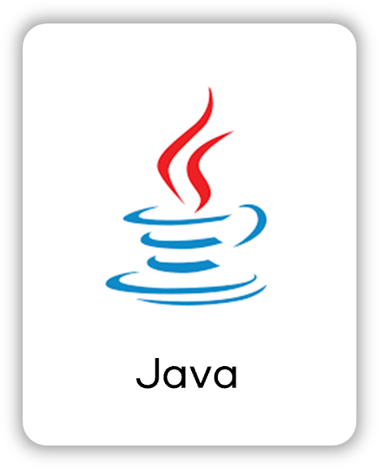
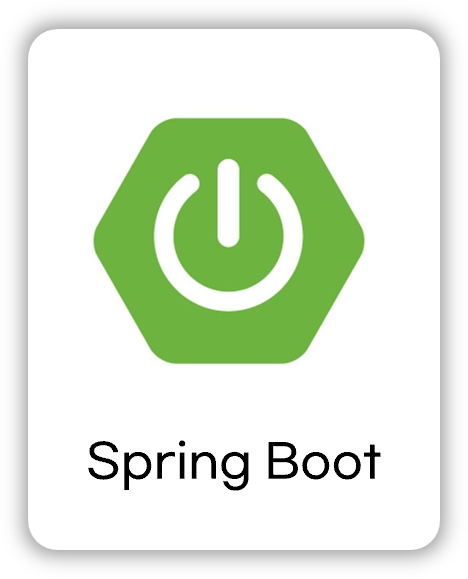
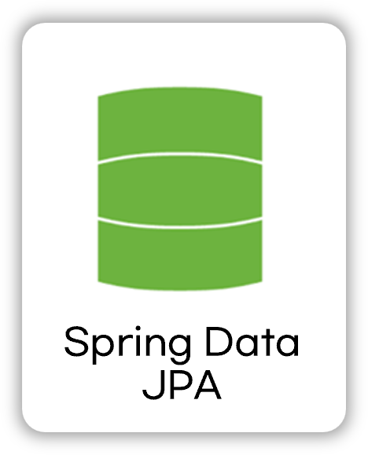
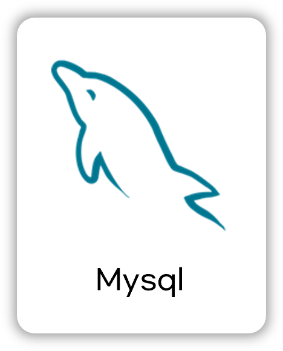
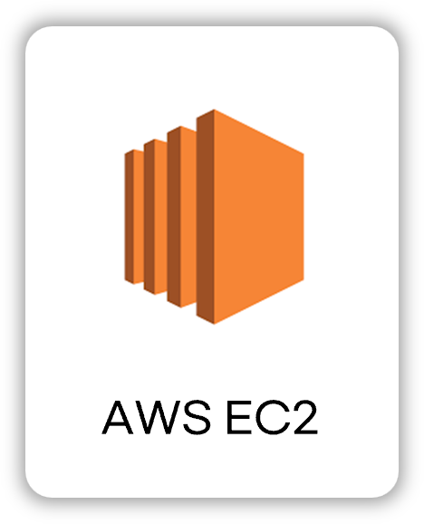
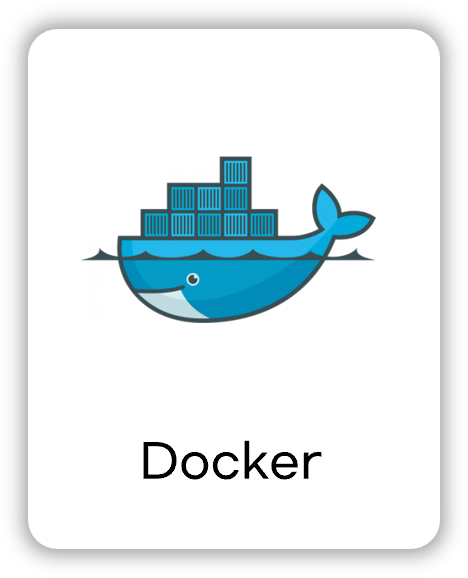
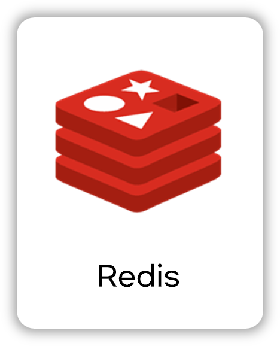
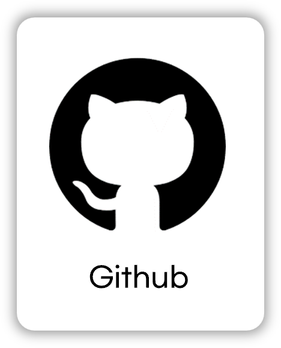
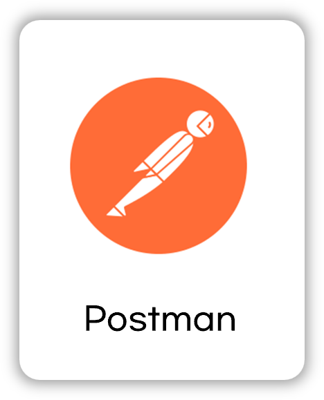
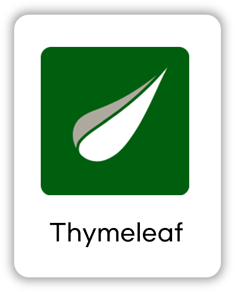

### 블로그 프로젝트

  

 

## 📝 소개
백엔드 깃 레파지토리의 README.md를 빠르게 작성하기 위해 만든 템플릿입니다.

다음과 같은 내용을 작성할 수 있습니다.
- 프로젝트 소개
- 프로젝트 화면 구성 또는 프로토 타입
- 프로젝트 API 설계
- 사용한 기술 스택
- 프로젝트 아키텍쳐
- 기술적 이슈와 해결 과정
- 프로젝트 팀원

 

### 프로토타입

 

## 🗂️ APIs
작성한 API는 아래에서 확인할 수 있습니다.

👉🏻 [API 바로보기](APIs.md)

 

## ⚙ 기술 스택
### Back-end

### Infra - 적용예정

### Tools

### 적용예정

 

## 🛠️ 프로젝트 아키텍쳐
예정

 

## 🤔 기술적 이슈와 해결 과정
- 예정
    - 링크
- 예정
  - 링크

 
