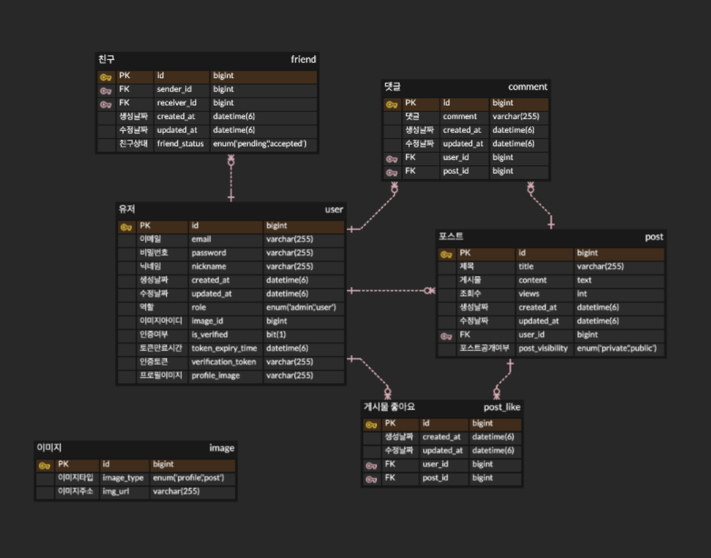

### 블로그 프로젝트

  

 

## 📝 소개

## 주요 기능

### 1. **유저 관련 기능**
- **회원가입/로그인**: 유저는 이메일 인증을 통해 회원가입을 진행하고, 로그인하여 플랫폼을 이용할 수 있습니다.
- **유저 프로필 관리**: 유저는 자신의 프로필을 수정하고, 다른 유저의 프로필을 확인할 수 있습니다.

### 2. **포스팅 기능**
- **포스팅 작성**: 유저는 텍스트와 이미지를 삽입하여 포스팅을 작성할 수 있습니다.
- **포스팅 수정/삭제**: 작성한 포스팅은 수정하거나 삭제할 수 있어, 관리가 용이합니다.
- **포스팅 비밀글**: 포스팅의 공개여부를 설정할 수 있습니다.
- **포스팅 임시저장**: 포스팅 작성 중 임시저장을 하고 나중에 다시 작성할 수 있습니다.
- **포스팅 인기글**: 최근 1주일 내에 올라온 포스팅 중 조회수가 높은 10개의 글을 조회할 수 있습니다.
- **포스팅 검색**: 제목으로 원하는 포스팅을 검색 할 수 있습니다.
- **친구들의 포스팅**: 친구들의 포스팅만 볼 수 있습니다.

### 3. **포스팅 좋아요 기능**
- **좋아요**: 유저는 다른 유저의 포스팅에 '좋아요'를 눌러 긍정적인 피드백을 제공할 수 있습니다.
- **좋아요 취소**: 이미 좋아요를 누른 포스팅은 좋아요를 취소할 수 있습니다.
- **좋아요 누른 게시물 조회**: 유저는 자신이 좋아요를 누른 게시물을 조회할 수 있습니다.
- **좋아요 누른 유저확인**: 포스팅에 좋아요를 누른 유저의 닉네임을 확인할 수 있습니다.

### 4. **댓글 기능**
- **댓글 작성**: 유저는 포스팅에 댓글을 작성하여 다른 유저들과 소통할 수 있습니다.
- **댓글 수정/삭제**: 작성한 댓글은 수정하거나 삭제할 수 있어 댓글 관리가 가능합니다.
- **댓글 목록**: 자신 혹은 다른유저의 댓글목록을 확인할 수 있습니다.

### 5. **친구 기능**
- **친구 추가/삭제**: 유저는 다른 유저를 친구로 추가하거나 삭제할 수 있습니다.
- **친구 목록**: 친구 추가 후에는 친구 목록을 확인할 수 있습니다.
- **친구수락 대기 중**: 내가 보낸 혹은 내가 받은 대기중인 친구요청 목록을 볼 수 있습니다.

## 🗂️ APIs
작성한 API는 아래에서 확인할 수 있습니다.

👉🏻 [API 바로보기](APIs.md)

 

## ⚙ 기술 스택
### Back-end

### Infra

### Tools

 

## 🛠️ ERD

 

## 🔥 적용 예정 기술

- ***Redis*** : ~~게시글 동시조회 등 동시성 제어를 위해 사용예정입니다.~~ 25.02.12 적용 완료
- ***RabbitMQ*** : ~~회원가입시 이메일 인증확인을 비동기적으로 처리하기위해 적용예정입니다.~~ 25.03.02 적용 완료
- ***AWS EC2*** : 배포를 위해서 사용예정입니다.
- ***Docker*** : 편리한 배포환경을 위해 사용예정입니다.

## 🤔 기술적 이슈와 해결 과정

- JOIN FETCH 와 Pageable 을 같이 사용했을때, 생기는 경고에 대한 문제해결
    - [Tistory](https://notion2326.tistory.com/2)

- 글과 글 사이에 이미지가 첨부된 블로그형태의 구현고민 
    - [Tistory](https://notion2326.tistory.com/3)

 
